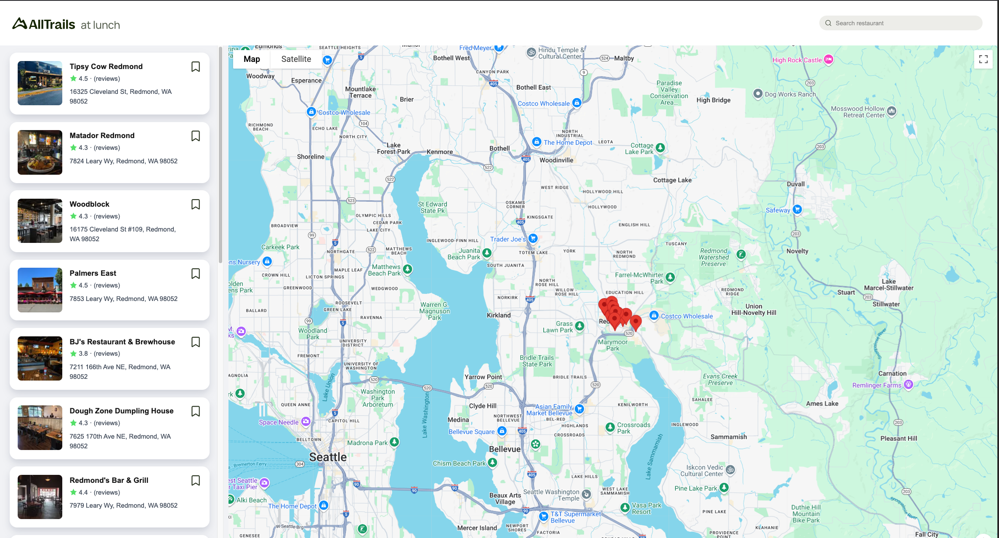

# AllTrails Take Home

### Figma

- Figma Designs click [here](https://www.figma.com/file/1I4xPrVbqaWCcEcA1wySox/Homework%3A-AllTrails-at-lunch?node-id=0%3A1&t=pZ21obo1DhD8oIoQ-0)

### Demo Video

- Demo video click [here](https://www.loom.com/share/ca1e6c54a6554416ad17c56076a30b67?sid=8b1d4dcd-06ad-4442-8355-546b0551f75f).

### Images

### Requirements

1. The web app will use the Google Places API for its data source.
2. The web app should display the search results as a list. Search results on the list should include basic information about the restaurant.
3. A search feature will be included that allows the user to search for restaurants.
4. The web app should display the search results as pins on a map.

### Project Requirements

- React implementation.
- Layout should match invision design.
- The code should be written with a production level of quality as if it were going to be
  distributed as-is.
- The developer may make use of third party libraries.

### Bonus Points

- Allow the user to flag restaurants as a favorite, and indicate its favorite status in the
  current and future search results.
- One or two test cases implemented with jest or a framework of your choice.
